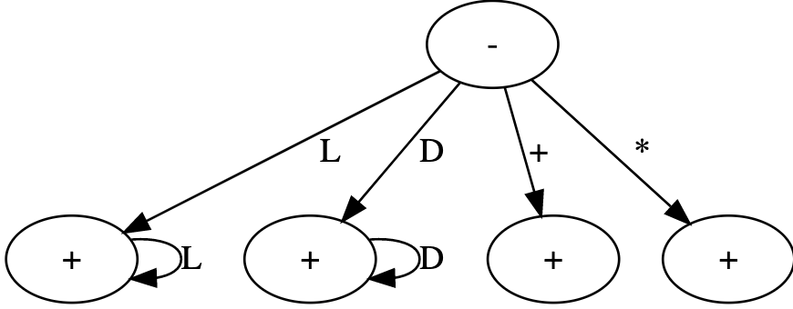

# Calculadora Infija Manual

## Máquina de estado



## Gramática Léxica

```xml
<token> -> uno de <identificador> <constante> <adición> <multiplicación>
<identificador> -> <letra> {<letra>}
<constante> -> <dígito> {<dígito>}
<operador> -> uno de <adición> <multiplicación>
<adición> -> +
<multiplicación> -> *
<letra> -> una de a-z A-Z
<dígito> -> uno de 0-9
```

## Gramática Sintáctica

```xml
<objetivo> -> <programa>
<programa> -> <expresion>
<expresión> -> <primaria> {<operador> <primaria>}
<primaria> -> <identificador> |
              <constante>
```

## Tabla de Tokens

| Programa Fuente   | Token          | Función          |
|-------------------|----------------|------------------|
| Estado inicial    | INICIAL        | N/A              |
| +                 | ADICION        | Adición()        |
| *                 | MULTIPLICACION | Multiplicación() |
| [A-Za-z]+         | IDENTIFICADOR  | Identificador()  |
| [0-9]+            | CONSTANTE      | Constante()      |
| EOF               | FDT            | FinDeTexto()     |
| Carácter inválido | UNDEFINED      | N/A              |

## Caracteres a ignorar

- Espacios en blanco
- Tabulados
- Marcas de fin de línea