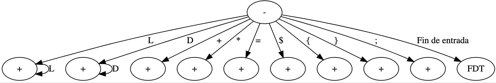

# Calculadora Infija Manual

## Nivel Léxico

Para el nivel léxico se generó una máquina de estado y una gramática léxica, para identificar los tokens y lexemas válidos para el LP

Para la implementación del nivel léxico, se desarrollo un `Scanner`, que toma los caracteres del stdin con la función `getchar()`, y expone tokens válidos mediande la función `GetNextToken()`

### Máquina de estado



### Gramática Léxica

```xml
<token> -> uno de <identificador> <constante> <adición> <multiplicación> <evaluacion> <asignacion> <inicio> <fin> <separador> <parentesis_izq> <parentesis_der>
<identificador> -> <letra> { <letra> }
<constante> -> <dígito> { <dígito> }
<adición> -> +
<multiplicación> -> *
<evaluacion> -> $
<asignacion> -> =
<letra> -> una de a-z A-Z
<dígito> -> uno de 0-9
<inicio> -> {
<inicio> -> }
<separador> -> ;
<parentesis_izq> -> (
<parentesis_der> -> )
```

### Tabla de Tokens

| Programa Fuente   | Token          | Función               |
| ----------------- | -------------- | --------------------- |
| Estado inicial    | INICIAL        | N/A                   |
| +                 | ADICION        | Adición()             |
| *                 | MULTIPLICACION | Multiplicación()      |
| [A-Za-z]+         | IDENTIFICADOR  | Identificador()       |
| [0-9]+            | CONSTANTE      | Constante()           |
| (                 | PARENTESIS_IZQ | ParentesisIzquierdo() |
| )                 | PARENTESIS_DER | ParentesisDerecho()   |
| {                 | INICIO         | Inicio()              |
| }                 | FIN            | Fin()                 |
| ;                 | PUNTO_Y_COMA   | PuntoYComa()          |
| $                 | EVALUACION     | Evaluacion()          |
| =                 | ASIGNACION     | Asignacion()          |
| EOF               | FDT            | FinDeTexto()          |
| Carácter inválido | ERROR_LEXICO   | ErrorLéxico()         |


### Caracteres a ignorar

- Espacios en blanco
- Tabulados
- Marcas de fin de línea

## Nivel Sintáctico

Para el nivel sintáctico se generó una gramática independiente del contexto (GIC)

### Gramática Sintáctica

```xml
<objetivo>          ->  <programa>
<programa>          ->  <inicio> <listaSentencias> <fin>
<listaSentencias>   ->  <sentencia> { <sentencia> } 
<sentencia>         ->  <identificador> <asignacion> <expresion> <separador> |
			            <evaluacion> <expresion> <separador>
<expresión>         ->  <termino> { <adicion> <expresion> }
<termino>           ->  <factor> { <multiplicacion> <termino> }
<factor>            ->  <identificador> |
                        <constante> |
                        <parentesis_izq> <expresión> <parentesis_der>
```

Para el análisis sintáctico se utilizó `Analisis Sintactico Descendente Recursivo`, implementado a través de invocaciones a rutinas de forma recursiva.
Cada función invocada se denomina `Procedimiento de Analisis Sintactico (PAS)`

Algunos `PAS` ejecutan rutinas semánticas, para reducir la expresión a un valor entero, lo cual se utiliza para realizar la evaluación de la expresión y mostrar el valor obtenido.

Para la implementación del nivel sintáctico, se desarrollo un `Parser`, con las siguientes funciones:

- Objetivo(): da comienzo al programa y valida que se ingrese el token FDT
- Programa(): valida que se ingrese el token INICIO, llama a la ListaSentencias y valida que se ingrese el token FIN
- ListaSentencias(): invoca a la función Sentencia(), y opcionalmente otras sentencias
- Sentencia(): invoca a las funciones Match() y Expresión() en base a las producciones. Agrega el valor asociado al identificador en la tabla de símbolos.
- Expresión(): devuelve el resultado devuelto por el término, sumado al valor recursivo de llamar al PAS expresión
- Término(): devuelve el resultado devuelto por el factor, multiplicado por el valor recursivo de llamar al PAS término
- Factor(): devuelve el valor numérico de la constante, o el valor asociado al identificador, o el resultado de una expresión entre paréntesis
- Match(): invoca a la función del Scanner `GetNextToken()`, si el valor no coincide con el esperado se produce un error sintáctico

## Tabla de símbolos

Para almacenar los valores asociados a los identificadores, y poder utilizarlo en otras sentencias, se utilizó una tabla de símbolos (memoria) donde se almacena un array de structs, con el nombre del identificador y el valor numérico asociado.

La tabla de símbolos soporta hasta 100 identificadores, y utiliza un índice, que comienza en 0, para manejar la posición de inserción del próximo identificador.

Al realizar una asignación de una expresión a un identificador, se realiza un búsqueda lineal sobre el array para buscar coincidencia con el nombre del identificador.

En caso de no encontrarse en memoria, se guarda en la posición que indique el índice y posteriormente se incrementa este último.

En caso de encontrarse en memoria, se sobreescribe el valor almacenado por el nuevo valor resultado de evaluar la expresión.

Cuando se utilice el identificador en una evaluación o asignación, se buscará en la tabla de símbolos y en caso de encontrarse se devolverá el valor entero asociado.

En caso de no encontrarse el identificador en la tabla de símbolos se producirá un error (informado por stdout) y se abortará el programa.

## Escenarios de error

Ante los siguientes escenarios, se considera que el programa alcanzó un estado de error, y se aborta el mismo.

- Error léxico: al detectar un carácter que no es válido para ningún lexema en el LP
- Error sintáctico: la secuencia de tokens no forma parte de la gramática del programa
- Error memoria: el identificador utilizado no tiene ningún valor asociado en la tabla de símbolos