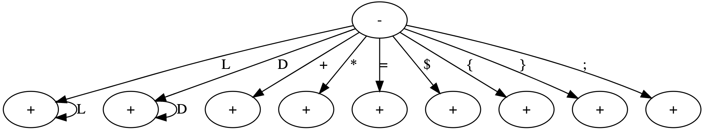

# Calculadora Infija Manual

## Máquina de estado



## Gramática Léxica

```xml
<token> -> uno de <identificador> <constante> <adición> <multiplicación> <evaluacion> <asignacion> <inicio> <fin> <separador>
<identificador> -> <letra> { <letra> }
<constante> -> <dígito> { <dígito> }
<adición> -> +
<multiplicación> -> *
<evaluacion> -> $
<asignacion> -> =
<letra> -> una de a-z A-Z
<dígito> -> uno de 0-9
<inicio> -> {
<inicio> -> }
<separador> -> ;
```

## Gramática Sintáctica

```xml
<objetivo> -> <programa>
<programa> -> <inicio> <listaSentencias> <fin>
<listaSentencias> -> <sentencia> { <sentencia> } 
<sentencia> -> <identificador> <asignacion> <expresion> <separador> |
							 <evaluacion> <expresion> <separador>
<expresión> -> <termino> { <adicion> <expresion> }
<termino> -> <factor> { <multiplicacion> <termino> }
<factor> -> <identificador> |
            <constante> |
            ( <expresión> )
```

## Tabla de Tokens

| Programa Fuente   | Token          | Función               |
| ----------------- | -------------- | --------------------- |
| Estado inicial    | INICIAL        | N/A                   |
| +                 | ADICION        | Adición()             |
| *                 | MULTIPLICACION | Multiplicación()      |
| [A-Za-z]+         | IDENTIFICADOR  | Identificador()       |
| [0-9]+            | CONSTANTE      | Constante()           |
| (                 | PARENTESIS_IZQ | ParentesisIzquierdo() |
| )                 | PARENTESIS_DER | ParentesisDerecho()   |
| {                 | INICIO         | Inicio()              |
| }                 | FIN            | Fin()                 |
| ;                 | PUNTO_Y_COMA   | PuntoYComa()          |
| $                 | EVALUACION     | Evaluacion()          |
| =                 | ASIGNACION     | Asignacion()          |
| EOF               | FDT            | FinDeTexto()          |
| Carácter inválido | ERROR_LEXICO   | N/A                   |

## Caracteres a ignorar

- Espacios en blanco
- Tabulados
- Marcas de fin de línea

## Reparación de error léxico

Al detectar que un carácter que no es válido para ningún lexema en el LP, se aborta el programa con un mensaje de error.